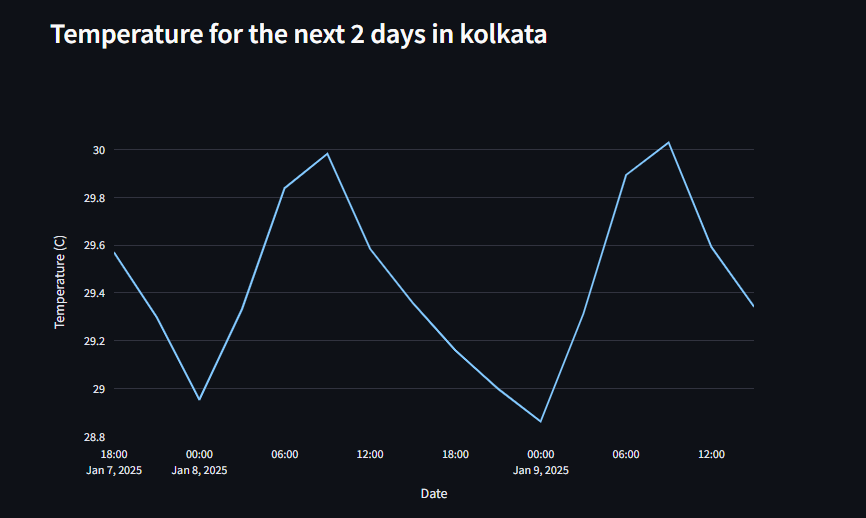
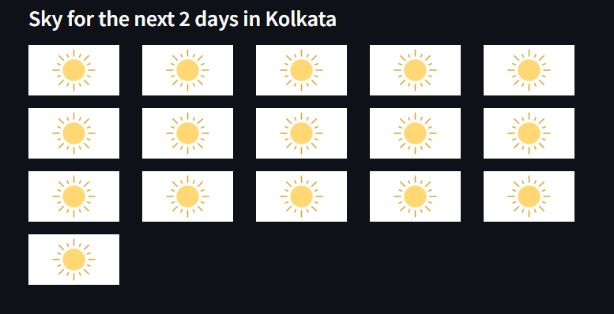

# Weather Forecast App

This is a simple **Weather Forecast App** built with **Streamlit** and **Plotly** that provides weather forecasts for the next few days. The app retrieves data from the OpenWeatherMap API and displays temperature trends or sky conditions for a specified location.

## Features
- **Search by Place**: Enter a city name to fetch weather forecasts.
- **Forecast Range**: Choose between 1 to 5 days of forecasts.
- **View Options**:
  - **Temperature**: Displays a line graph of temperature trends.
  - **Sky Condition**: Shows icons for weather conditions (e.g., Clear, Clouds, Rain, Snow).
- **Interactive UI**: Powered by **Streamlit** for easy-to-use and visually appealing interfaces.

---

## Installation

### 1. Clone the Repository
```bash
git clone https://github.com/yourusername/weather-forecast-app.git
cd weather-forecast-app

2. Set Up the Environment
Install Python (if not already installed). Version 3.7 or higher is recommended.
Install the required dependencies:
bash
Copy code
pip install -r requirements.txt
3. Add API Key
Create a .env file or directly edit the backend.py file.
Add your OpenWeatherMap API key:
python
Copy code
API_KEY = "your_openweathermap_api_key"
4. Run the Application
bash
Copy code
streamlit run main.py
File Structure
bash
Copy code
weather-forecast-app/
├── main.py          # Streamlit app logic for UI
├── backend.py       # Backend logic for fetching weather data
├── images/          # Icons for weather conditions
├── .gitignore       # To hide sensitive data like API keys
├── requirements.txt # List of Python dependencies
└── README.md        # Project documentation
Usage
Enter a place in the text input field.
Select the number of forecast days using the slider.
Choose to view either Temperature or Sky Condition:
Temperature: Displays a temperature vs. date line chart.
Sky Condition: Displays icons for Clear, Clouds, Rain, or Snow.
Example
Place: Tokyo
Forecast Days: 3
View Option: Temperature
The app will fetch and display a temperature trend for the next 3 days in Tokyo.

Screenshots
Temperature View



Sky Condition View



Notes
Ensure your API key from OpenWeatherMap is valid and has access to the required data.
The app requires an internet connection to fetch weather data.
